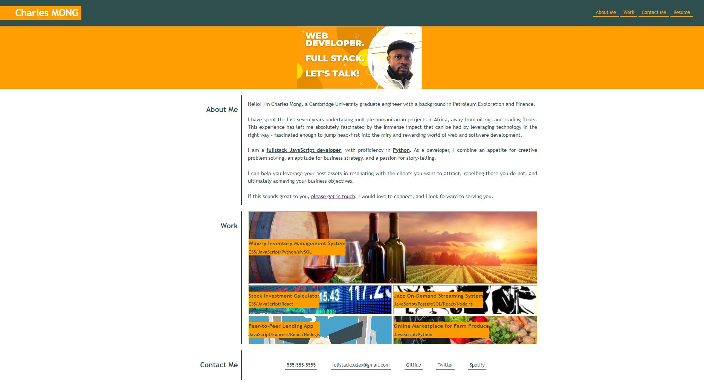

# Web Developer Portfolio Page - Charles Mong

## Description

I sought to build a portfolio page to showcase my skills and highlight my strongest work as a developer. This will be a point of reference for potential employers and collaborators in the future.  


It is not enough to learn or know theories and concepts. The best way to stand out from the herd as a developer is to continue to utilise one's skills to continually build projects and applications that solve problems and leverage technology.  


I have chosen to use Flexbox, CSS Grids, Media Queries and CSS Variables in creating this portfolio page.  


This is a work in progress, which I will continue to add to as I garner more and more experience.  


## Acceptance Criteria

The following criteria are requisites for a portfolio that would attract a typical hiring manager:

```
- When the page is loaded the page presents your name, a recent photo or avatar, and links to sections about you, your work, and how to contact you
- When one of the links in the navigation is clicked then the UI scrolls to the corresponding section
- When viewing the section about your work then the section contains titled images of your applications
- When presented with the your first application then that application's image should be larger in size than the others
- When images of the applications are clicked then the user is taken to that deployed application
- When the page is resized or viewed on various screens and devices then the layout is responsive and adapts to my viewport
```

## Installation

The webpage was built using CSS Flexbox for the structural framework, in tandem with media queries, to make it responsive for all devices and all viewport widths.   

Within the "Work" section, which showcases selected pieces of work from my portfolio, CSS Grid was used. This was the more optimal choice to give precedence to the preeminent piece of work in my portfolio, while also showing four others.

The images are labelled, and clicking anywhere on an image will take you to the deployed application.

The site, linked below, was deployed using GitHub Pages. 

## Usage and Access

The webpage was built to create an optimised user experience for device widths below 768px, from 768px to 1200px, and above 1200px.

[Link to the deployed Portfolio website on GitHub Pages](https://ccmong.github.io/Charles-Mong-Portfolio/)

[Link to the GitHub code repository](https://github.com/CcMong/Charles-Mong-Portfolio)
  



## Licenses

N/A

## Badges

N/A

